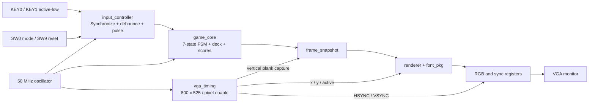
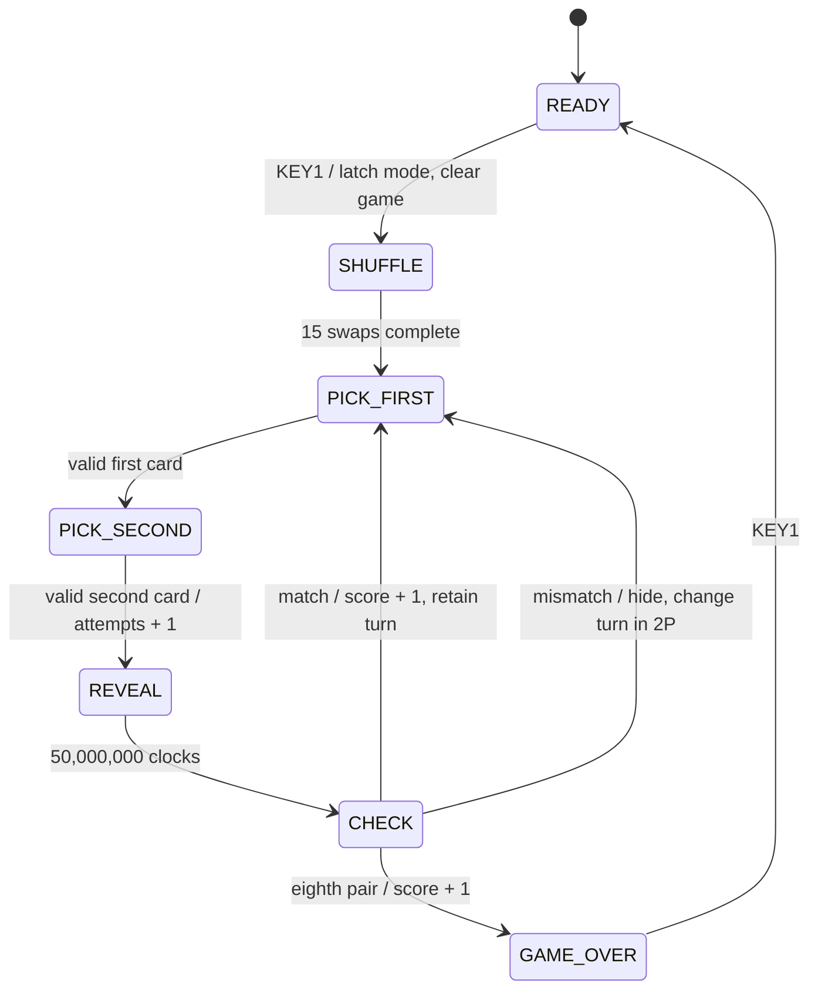

# รายงานการออกแบบเกมจับคู่การ์ด

## วัตถุประสงค์

สร้างเกมจับคู่การ์ด 16 ใบบน DE10-Lite ด้วย FSM มากกว่า 3 สถานะ และแสดงผล VGA 640×480 ประมาณ 60 Hz เกมรองรับหนึ่งหรือสองผู้เล่น ใช้ปุ่มและสวิตช์บนบอร์ดเท่านั้น

## Block diagram

ทุกโมดูลใช้ clock 50 MHz เดียว การวาดพิกเซลใช้ enable ทุกสองรอบ clock จึงได้ 25 MHz ไม่มีการใช้ปุ่มหรือเอาต์พุต logic เป็น clock

## State diagram

SW9 มีลำดับสูงกว่าการเปลี่ยนสถานะทั้งหมดและนำกลับ READY จากทุกสถานะ อินพุตที่ไม่เข้าเงื่อนไขให้อยู่สถานะเดิม ระหว่าง SHUFFLE, REVEAL และ CHECK ไม่รับปุ่มเล่น

## State table

| สถานะปัจจุบัน | เงื่อนไข | การทำงาน | สถานะถัดไป |
|---|---|---|---|
| ทุกสถานะ | reset_game=1 | ล้างเกม คะแนน และตัวจับเวลา | READY |
| READY | KEY1 | บันทึก SW0, สร้าง A–H อย่างละสองใบ, เลือก seed | SHUFFLE |
| READY | ไม่กด | แสดงโหมดที่เลือกจาก SW0 | READY |
| SHUFFLE | ยังไม่ครบ 15 swaps | คำนวณตำแหน่งและสลับหนึ่งคู่ตำแหน่ง | SHUFFLE |
| SHUFFLE | ครบ 15 swaps | เริ่มเลือกการ์ดที่ตำแหน่ง 0 | PICK_FIRST |
| PICK_FIRST | KEY1 บนใบที่ยังไม่จับคู่ | บันทึกตำแหน่งและเปิดใบแรก | PICK_SECOND |
| PICK_SECOND | KEY1 บนใบอื่นที่ยังไม่จับคู่ | เปิดใบที่สอง, เพิ่ม attempts, เริ่มจับเวลา | REVEAL |
| PICK_FIRST / PICK_SECOND | KEY1 บนใบที่เลือกไม่ได้ | ไม่มีผล รวมถึงไม่เลื่อนหาก KEY0 มาพร้อมกัน | เดิม |
| PICK_FIRST / PICK_SECOND | KEY0 และไม่มี KEY1 | เลื่อนเคอร์เซอร์ วน 15 → 0 | เดิม |
| REVEAL | ยังไม่ครบ 1 วินาที | เปิดสองใบค้าง | REVEAL |
| REVEAL | ครบ 1 วินาที | รอรอบตรวจผล | CHECK |
| CHECK | ถูกและยังไม่ครบ 8 คู่ | mark matched, เพิ่มคะแนน, ไม่สลับตา | PICK_FIRST |
| CHECK | ผิด | ปิดสองใบ, สลับตาเฉพาะโหมด 2 คน | PICK_FIRST |
| CHECK | ถูกและเป็นคู่ที่ 8 | mark matched และเพิ่มคะแนนครั้งสุดท้าย | GAME_OVER |
| GAME_OVER | KEY1 | กลับหน้าพร้อมเล่น | READY |

CHECK ใช้หนึ่ง clock จึงเพิ่มคะแนนเพียงครั้งเดียว คู่สุดท้ายตรวจจากค่าเดิม `pairs=7` แล้วเพิ่มเป็น 8 พร้อมเปลี่ยนเป็น GAME_OVER หน้าจอใช้คะแนนที่อัปเดตแล้ว ผู้เล่นสองคนได้ 4–4 ให้แสดง DRAW

## ข้อมูลและ interfaces

`game_pkg.view_t` เป็นข้อมูลเชื่อม `game_core → frame_snapshot → renderer` ประกอบด้วย:

- `state`: enum ของ 7 สถานะ
- `cards`: 16 ค่า แต่ละค่า 0–7 แทน A–H
- `matched`: 16 บิต ระบุคู่ที่เปิดถาวร
- `cursor`, `first_card`, `second_card`: ตำแหน่ง 0–15
- `two_players`, `player`: โหมดและเจ้าของตา (0 คือ P1)
- `score1`, `score2`, `pairs`: 0–8 และ `attempts`: 0–999

`input_controller` ส่งเหตุการณ์หนึ่ง clock ของ `next_press` และ `open_press` ปุ่ม active-low ผ่าน flip-flop สองขั้นและ debounce ทั้งกด/ปล่อย ส่วน SW0 ผ่านสองขั้น SW9 assert reset แบบ asynchronous และ release ผ่านสองขั้น; game_core รับ reset แบบ synchronous ที่ clock ถัดไป

ระหว่างเปิดใบแรกและใบที่สอง การเปิดหน้าการ์ดคำนวณจาก state/ตำแหน่งและ matched mask ไม่แก้ค่าการ์ดใน deck

## การสุ่ม

ใช้ Fisher–Yates จาก i=15 ลงถึง 1 โดย j=`rng mod (i+1)` และสลับการ์ด i กับ j ใช้ LFSR 16 บิต polynomial x^16+x^14+x^13+x^11+1 เลื่อนซ้าย แล้วใส่ XOR ของบิต 15,13,12,10 ที่บิต 0

Seed มาจากตัวนับ 16 บิตที่วิ่งตลอดเวลา หากเป็นศูนย์ใช้ ACE1 แทน การหารเอาเศษทำแบบทีละบิต 16 clock แล้ว swap อีกหนึ่ง clock จึงใช้ 255 clock หรือ 5.1 us ต่อการสลับ deck ทั้งชุด ลดวงจรหารขนาดใหญ่และรักษาจำนวนของการ์ดทุกชนิดอย่างละสองใบ

## VGA และภาพ

- Horizontal: active 640, front porch 16, sync 96, back porch 48; รวม 800
- Vertical: active 480, front porch 10, sync 2, back porch 33; รวม 525
- HSYNC ต่ำที่ x=656–751, VSYNC ต่ำที่ y=490–491
- Pixel enable 25 MHz จาก clock 50 MHz; refresh = 25,000,000/(800×525) = 59.5238 Hz
- RGB 4 บิตต่อสี รวม 12 บิต และเป็นศูนย์ใน blanking
- จับสำเนา view ที่ขอบเข้าสู่ vertical blank (x=799,y=479) หน้าจอจึงใช้ข้อมูลชุดเดียวตลอดเฟรม
- Renderer มี pipeline หนึ่งพิกเซล แยกการเลือกตัวอักษร/ตำแหน่งออกจากการอ่านฟอนต์; HSYNC/VSYNC ถูกหน่วงเท่ากันก่อน register เอาต์พุต RGB จึงยังตรงกับขอบภาพ
- รีเซ็ตเกมไม่หยุดสัญญาณ sync ภาพ READY จะปรากฏหลังการจับสำเนาครั้งถัดไป

การ์ดเริ่ม (144,80) ใบละ 80×80 เว้น 8 พิกเซล ขอบนอกตารางอยู่ที่ x=487,y=423 ใช้ฟอนต์ bitmap 5×7 ที่เขียนไว้ใน font_pkg ตัวการ์ดขยาย 6 เท่าและข้อความขยาย 2 เท่า ไม่ต้องใช้ ROM รูปภาพหรือ framebuffer

ตำแหน่งขาอ้างอิง `DE10_LITE_Golden_Top/platform_setup.tcl` จาก Quartus 25.1std ที่ติดตั้งในเครื่อง โดยเลือกชิปรุ่น production 10M50DAF484C7G แทนชิป engineering-sample ที่ระบุใน template เก่า

## ข้อจำกัด

การสุ่มด้วย modulo มี bias เล็กน้อย เหมาะสำหรับเกมสาธิต; การกดเร็วกว่า debounce อาจไม่ถูกนับ; จอที่ต้องการ pixel clock 25.175 MHz อย่างเคร่งครัดอาจไม่ยอมรับ 25 MHz ต้องยืนยันกับจอจริง ผล simulation ไม่แทนการทดสอบบอร์ดและคุณภาพสัญญาณ VGA จริง
