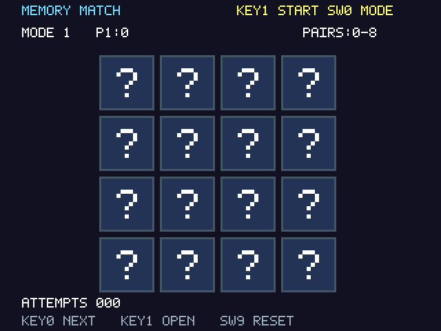
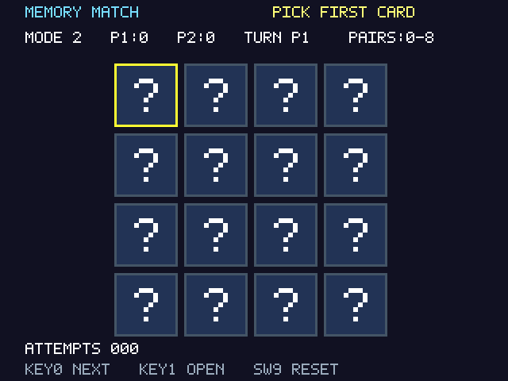
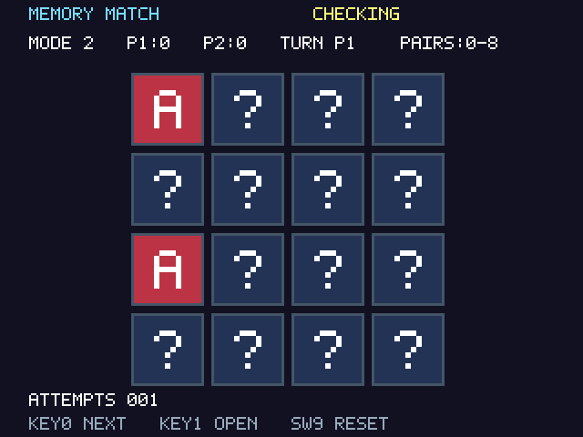
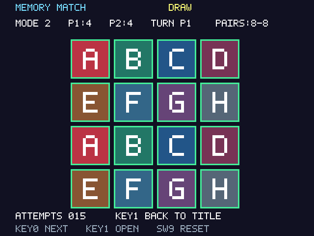
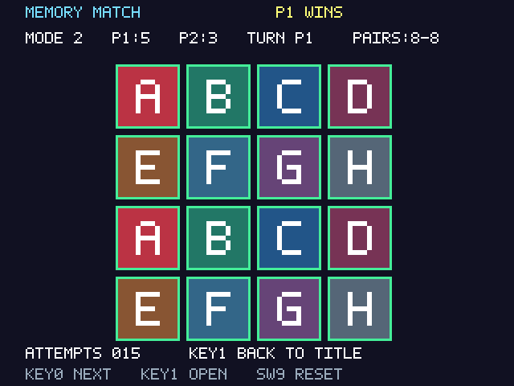
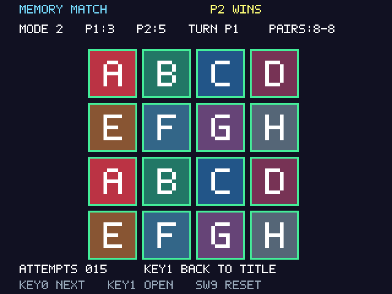
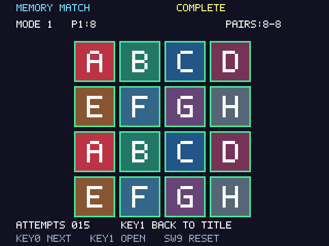

# ผลตรวจสอบ — 2 ตุลาคม 2026

## Quartus / ชิปเป้าหมาย

ทดสอบด้วย Quartus Prime Lite **25.1std.0 Build 1129** สำหรับ **10M50DAF484C7G**, clock 50 MHz

- Full compilation สำเร็จ สร้าง `output_files/memory_match.sof`
- Timing ผ่านทุก model ที่ตรวจ ไม่มี Critical Warning และไม่มี timing violation
- Slow 1200mV 85°C: Fmax **50.90 MHz**; slow 0°C: **56.03 MHz**
- Worst setup slack **+0.353 ns**; worst hold slack **+0.148 ns**
- ใช้ **2,842 / 49,760 logic elements (6%)**, 416 registers, 27 pins
- ไม่ใช้ block RAM, DSP multiplier หรือ PLL
- รายงาน unconstrained paths เป็นศูนย์ทั้ง setup และ hold
- เทียบขาที่ fitter ใช้ทั้ง 27 ขากับ Golden Top ของ DE10-Lite แล้วตรงกันทั้งหมด

เหลือ 11 warnings ที่ไม่ใช่ timing failure: กลุ่มสวิตช์ SW1–SW8 ไม่ได้ใช้งาน (9 รายการรวมข้อความหลัก), ข้อความสิทธิ์ใช้งาน LogicLock (1) และข้อกำหนดไฟฟ้าของ I/O MAX 10 (1) ทุกขาที่ใช้มี location, I/O standard และเอาต์พุต VGA กำหนด drive strength 8 mA

Clock constraint เป็น 20 ns จริง ไม่มี multicycle exception เพื่อซ่อนเส้นทาง logic ที่ช้า ยกเว้นเส้นทางเข้าจากปุ่ม/สวิตช์ asynchronous; เอาต์พุต VGA ใช้งบ settling 10 ns สำหรับวงจร DAC ของบอร์ด ไม่ได้อ้างว่าเป็นการวัดสัญญาณจริง

หลักฐานต้นฉบับ: `output_files/memory_match.fit.summary`, `output_files/memory_match.sta.rpt` และ `build/critical_paths.txt`, `build/unconstrained_paths.txt`

## Simulation

ใช้ **Questa Altera Starter FPGA Edition 2025.2** และ assertions ที่หยุด testbench เมื่อผิดพลาด ชุดทดสอบที่ผ่านต้องรายงาน `PASS <ชื่อ testbench>` และเรียก `std.env.finish` เท่านั้น; timeout หรือ assertion error ทำให้คำสั่งคืน exit code ไม่สำเร็จ

- **tb_game_core**: ตรวจการ์ดทุกชนิดมีอย่างละสองใบหลังสลับหลาย seed; seed ต่างกันมี deck ต่างกัน; เคอร์เซอร์วนกลับ; KEY1 มีลำดับก่อน KEY0; ใบเดิม/ใบที่จับคู่แล้วเปิดซ้ำไม่ได้; รีเซ็ตครบทั้ง 7 สถานะ; โหมดถูกล็อกระหว่างเกม; เปิดสองใบครบจำนวน clock ที่กำหนด; ปุ่มช่วง REVEAL ไม่มีผล; คู่ถูก/ผิด; ผู้ชนะ P1/P2; เสมอ 4–4; คะแนนคู่สุดท้าย; เล่นซ้ำ; mismatch 1,002 ครั้งเพื่อพิสูจน์ counter ค้างที่ 999
- **tb_input_controller**: ตรวจ press/release bounce, กดค้าง, กดสองปุ่มพร้อมกัน, mode synchronizer, power-on reset และ asynchronous assertion/synchronous release ของ SW9
- **tb_video**: ตรวจพิกเซลทุกตำแหน่งสองเฟรมเต็ม 800×525, ช่วง active 307,200 พิกเซล, HSYNC 96 พิกเซลต่อแถว, VSYNC 2 แถว, pixel enable ทุกสอง clock, capture หนึ่งครั้งต่อเฟรม, snapshot hold/capture, black blanking, เคอร์เซอร์/สีหน้าไพ่ และสร้างภาพ 7 หน้าจอ
- **tb_top**: ตรวจเอาต์พุตจริงของ top-level สามเฟรมเต็ม, alignment ของ RGB/HSYNC/VSYNC หลัง pipeline, เอาต์พุตคงที่ระหว่าง pixel enable, ปุ่มเริ่มผ่าน input controller ถึงหน้าจอ และ sync ยังทำงานระหว่าง reset

หลักฐานแต่ละชุดอยู่ใน `build/sim/<testbench>.log` และ waveform `.wlf` ไฟล์เหล่านี้รวมใน ZIP ส่งงานด้วย

การจำลองใช้ debounce=4 รอบ และ reveal=8 รอบ เพื่อย่นเวลารัน โดยตรวจจำนวนรอบตรงตัว ค่า hardware ใน top ยังคง debounce=1,000,000 รอบและ reveal=50,000,000 รอบ

## ภาพจาก simulation

ภาพต่อไปนี้สร้างโดยป้อนข้อมูลฉากทดสอบเข้า **VHDL renderer จริง** แล้วอ่าน RGB ทีละพิกเซล บันทึก PPM และแปลง PNG เป็นฉากทดสอบที่กำหนดค่าไว้เพื่อทดสอบหน้าจอแต่ละแบบ ไม่ใช่ภาพการเล่นบนบอร์ดหรือภาพที่สร้างด้วย AI

## ยังต้องทดสอบกับฮาร์ดแวร์

ยังไม่ได้ program บอร์ดจริง จึงยังไม่มีภาพถ่ายหรือวิดีโอการทำงานจริง ต้องยืนยันการรับสัญญาณ 25 MHz ของจอ VGA, สี, ความนิ่งของภาพ และความรู้สึกในการกดปุ่มตาม [hardware-checklist.md](hardware-checklist.md)

GHDL ในเครื่องถูก Windows Application Control บล็อก จึงไม่ได้ใช้เป็นหลักฐานการทดสอบ โปรเจกต์ไม่มีการแก้ policy ของเครื่องเพื่อเปิดโปรแกรมที่ถูกบล็อก
